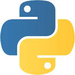

-----

**Design Thinking for Innovation - Coursera**
#### September 2020 | Mumbai, India

-----
*	

-----

**New Product Development For Small Businesses and Start-Ups - Coursera**
#### September 2020 | Mumbai, India

-----
*	

-----

**Programming for Everybody (Getting Started with Python) - Coursera**
#### September 2019 | Mumbai, India

-----
*	

-----

**AI For Everyone - Coursera**
#### August 2019 | Mumbai, India

-----
*	

-----

**Business Analytics - Interdisciplinary Course**
#### January 2018 - June 2018 | Mumbai, India

-----
*	Studies concepts like Regression, Time series modelling, Market basket analysis, Data visualization, Reporting
* Applied Business Analytics knowledge to statistically analyze variety of data and derive business value out of it 
* Developed a research report on the business of Cab Services in India  
