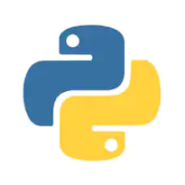

-----

**Digital Transformation - Leading the Modern Day Business**
#### September 2020 | Mumbai, India  [Course Certificate](https://www.coursera.org/account/accomplishments/verify/T8GJNQ7BNXB8)

-----
* Derived an insight on how trending technologies like Artificial Intelligence, Additive Manufacturing, Blockchain, Big Data, Deep Learning etc. are changing the face of today's business operations
* The course explained how incumbents can achieve Ambidexterity- a balance between exploitation of existing legacy processes and exploration of new emerging technologies in order to not only sustain but also excel in this fast-paced revolution of Industry 4.0
* The takeaways from this course have helped in shaping my mindset and guided me to take a step towards preparing me for my long term goal of playing a pivotal role in a top-notch organization

-----

**New Product Development For Small Businesses and Start-Ups (Guided Project)**
#### September 2020 | Mumbai, India

-----
*	Learned about idea generation and the evaluation processes in product development by using an idea generation model and online resources like Google Trends and Amazon
* Used methods to evaluate your product concept through market segmentation, growth potential, and the competition to the product
* Overall, I was able to create a full retrospective plan for the product launch and understand how and why the specifications are done
* [Course Certificate](https://www.coursera.org/account/accomplishments/verify/7ADEHMR9CA5Y)

-----

**Design Thinking for Innovation**
#### August 2020 | Mumbai, India

-----
*	The primary focus of this courses was on how incumbents and even newly emerging startups can adopt simple but effective business strategies to prosper in modern-day business
*	This course guided me on what are the most powerful questions one should ask while solving a business problem so as to get a clear picture of the task in hand and to explore the possibilities rather than being stuck on the constraints
* The coursework also covered topics that explained the importance of design thinking tools like Visualization, Storytelling, Mind Mapping, and Learning Launch which should be used while following the iterative process of design thinking in order to create effective and innovative solutions
* [Course Certificate](https://www.coursera.org/account/accomplishments/verify/HRRPUGSBG6LM)

-----

**Programming for Everybody - Getting Started with Python**
#### September 2019 | Mumbai, India

-----
*	Learned the basics of Python programming
*Course Certificate*:

-----

**Artificial Intelligence For Everyone**
#### August 2019 | Mumbai, India

-----
*	
*Course Certificate*:

-----

**Business Analytics (Interdisciplinary Course)**
#### January 2018 - June 2018 | Mumbai, India

-----
*	Studied concepts like Regression, Time series modelling, Market basket analysis, Data visualization, Reporting
* Applied Business Analytics knowledge to statistically analyze variety of data and derive business value out of it 
* Developed a research report on the business of Cab Services in India  
