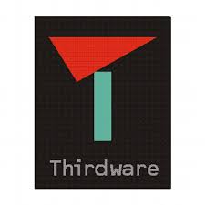
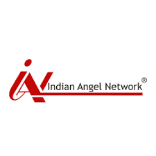
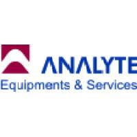

-----

**Software Engineer, [Thirdware Solutions Inc.](https://www.thirdware.com/index.html)** 
#### August 2019 - Present | Mumbai, India
----- 
* I am working in the Business Intelligence domain and have successfully completed my first project for the American multinational automaker, [Ford Motor Company](https://www.ford.com/). The task undertaken was to migrate multiple Hyperion Essbase applications and its supporting processes from their existing legacy systems to DCoF (Data Centre of the Future)
* I was given an opportunity to take complete onus of multiple applications right from planning the migration process to the final launch of the applications. The cutomer was quite happy with my performance and our project was given a 5 star rating by the customer
* Our project was awarded as the Best Project of the Year by the management of Thirdware Solutions and to add to it our team received the Best Team Award-Half Yearly too
* Our team's quality performance in this project won the confidence of Ford IT and Business team and gave Thirdware an edge over current competitors like EY and Donyati to successfully acquire more new projects in the same domain
**Key Learnings**  
  Technical Skills: Essbase, MaxL Scripting, Powershell Scripting, AutoSys, AccuRev  
  Soft Skills: Agile Methodologies, Adaptability, Teamwork, Time Management, Work Ethic 

-----

**Due Diligence Intern, [Indian Angel Network](https://www.indianangelnetwork.com/)**
#### July 2019 - December 2019 | Mumbai, India
-----
*	Was involved in tasks such as Due Diligence, Startup Sourcing and Networking.

-----

**Service Management Trainee, [Analyte Equipments and Services](http://analyte.net.in/)** 
#### May 2018 - July 2018 | Mumbai, India
----- 
* Worked as an intern in the field of Service Management for Emergency Electronic Systems
* Was responsible for daily service management and CRM software data updation

