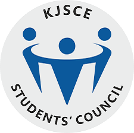
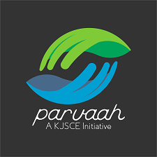
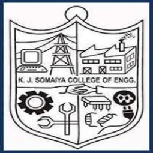
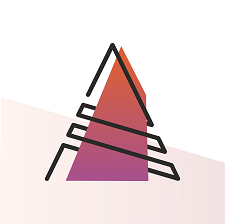
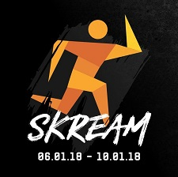

-----

**General Secretary, KJSCE Students' Council**
#### June 2017 - June 2018 | Mumbai, India

-----
* Was at the helm of all co-curricular and extra-curricular activities, all matters pertaining to logistics, marketing, finance and publicity of various intercollegiate events.
* Led a team of 40 core committee members and 250+ volunteers to organize national level festivals. viz, Abhiyantriki- Technical festival, Skream- Sports festival and Symphony- Cultural festival.

-----

**Team Lead, [KJSCE Parvaah](https://www.facebook.com/kjsce.Parvaah/)**
#### June 2016 - June 2019 | Mumbai, India

-----
* Head of the team which undertook a sixteen week long project of the Versova beach cleanup in association with Afroz Shah. This initiative was termed as the ‘World’s Largest Beach Clean-Up’ by the United Nations and was recognized and felicitated by the Inspector General of the Central Reserve Police Force (CRPF)
* Worked towards teaching sanitary habits and behavioural skills to the underprivileged children of [Signal Shala](http://signalshala.in/) and few other orphanages.
* Championed for the rights of the LGBTQ+ community in Mumbai through pride walks, cycle rallies and workshops
* Also worked towards beautifying a railway station in Mumbai, India as a part of the [Humara Station Humari Shaan](https://mumbaifirst.org/hamara-station-hamari-shaan/) initiative  

-----

**Vice Captain, KJSCE Volleyball Team**
#### June 2018 - June 2019 | Mumbai, India
-----
* Co-led the volleyball team of KJSCE in many inter-collegiate and national level sports tournaments
* Emerged victorious in couple of those tournaments and stood second in one  

-----

**Organizing Committee, [KJSCE Abhiyantriki](http://kjsce-abhiyantriki.org/)**
#### June 2016 - Septmeber 2017 | Mumbai, India

-----
* Hosted exhibits from Indian Space Research Organization (ISRO), Defence Research and Development Organization (DRDO) and Department of Atomic Energy (DAE) at the technical symposium of our college
* Organised events such as Internship Expo, Startup Expo and various technical events which saw a 200% increase in the number of participants from the previous year  

-----

**Organizing Committee, [KJSCE Skream](https://kjsce-skream.org/)**
#### June 2016 - Septmeber 2018 | Mumbai, India

-----
* Organised KJSCE Skream - National Level Sports festival comprising of 14 various sporting events conducted throughout the 5 days
* Used Google Analytics and Facebook Insights to understand the needs of sponsors and participants and saw an increase in the sponsor count from 50 to 75 and the number of particpants from 2500 to 4000 from the previous year
* Hosted national federations such as the [Wheelchair Basketball Federation of India, WBFI](http://www.wbfi.org.in/) and [Indian Blind Football Federation](http://blindfootball.in/) for exhibition matches
* We also managed to raise our profits by almost 15%  
-----
